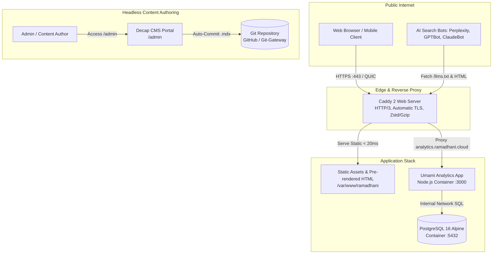

# 🏛️ System Architecture: The Ramadhani Authority Platform

This document outlines the software engineering principles, system architecture, performance optimization strategies, and data models powering **The Ramadhani** authority portfolio, research publication, and analytics platform.

---

## 1. Architectural Philosophy

The platform is designed around five core engineering tenets:

1. **Static-First Performance (SSG)**: Pre-render all pages at build time into pure static HTML, CSS, and minimal JavaScript to achieve sub-second Largest Contentful Paint (LCP) and zero server runtime overhead.
2. **Selective Hydration (Islands Architecture)**: Ship zero JavaScript by default; only hydrate interactive widgets (e.g. live audits, filters, accordions) when they enter the user viewport (`client:visible`).
3. **Machine Readability & Generative Engine Optimization (GEO)**: Structure content with semantic Knowledge Graphs, explicit direct-answer summaries, and machine directives (`llms.txt`, `robots.txt`) to maximize citation grounding in AI search engines (Perplexity, ChatGPT Search, Claude, Google AI Overviews).
4. **Privacy-Preserving Telemetry**: Self-host GDPR/CCPA-compliant web analytics with Umami and PostgreSQL, completely eliminating third-party tracking cookies.
5. **Modern Containerized Operations**: Multi-stage lightweight Docker containers orchestrated with Docker Compose, automated SSL via Caddy 2, and sub-50ms configuration hot-reloads.

---

## 2. High-Level Architecture Diagram



---

## 3. Frontend Architecture & Component Tree

The frontend is constructed using [Astro 5](https://astro.build) with [React 19](https://react.dev) components integrated as Astro Islands.

### 3.1 Page Hierarchy & Layouts
- **`BaseLayout.astro`**: Foundation layout containing HTML structure, `BaseHead.astro` (preloads, font definitions, OpenGraph meta, JSON-LD), global navigation header, and footer.
- **`PageLayout.astro`**: Standard layout for marketing, services, and profile pages with breadcrumb navigation.
- **`ArticleLayout.astro`**: Layout for technical articles with reading progress indicator, author metadata, tags, and table of contents.
- **`WorkLayout.astro`**: Layout for client case studies featuring impact metric scorecards, client industry badges, and executive quick answers.

### 3.2 React Islands Hydration Strategy
Interactive components are isolated into self-contained React islands, loaded asynchronously only when needed:

| Island Component | Hydration Directive | Responsibility |
| :--- | :--- | :--- |
| **`PerformanceAudit.tsx`** | `client:visible` | Queries Google PageSpeed Insights V5 API to provide live Core Web Vitals and GEO search readiness diagnostics for visitor domains. |
| **`WorkFilter.tsx`** | `client:visible` | Client-side reactive filtering and search for client case studies by service tag. |
| **`ArticleFilter.tsx`** | `client:visible` | Search bar and tag-based filtering for technical articles and guides. |
| **`FaqAccordion.tsx`** | `client:visible` | Accessible accordion with automated JSON-LD schema injection for FAQ rich snippets. |
| **`HeroInteractive.tsx`** | `client:load` | Smooth interactive canvas animations on the homepage hero section. |

---

## 4. Content Collections & Type-Safe Schema

Content is modeled as type-safe Markdown/MDX collections managed by Zod schemas in `src/content.config.ts`:

### 4.1 Articles Collection (`src/content/articles/`)
```typescript
{
  title: string;
  description: string; // 140-160 chars
  slug?: string;
  publishDate: Date;
  updatedDate?: Date;
  author: string; // Default: 'Ramadhani'
  tags: string[];
  coverImage?: string;
  coverAlt?: string;
  quickAnswer: string; // 40-60 words definitive summary
  featured?: boolean;
}
```

### 4.2 Work & Case Studies Collection (`src/content/work/`)
```typescript
{
  title: string;
  client: string;
  industry: string;
  service: string;
  description: string;
  slug?: string;
  publishDate: Date;
  coverImage?: string;
  coverAlt?: string;
  metrics: Array<{ value: string; label: string }>;
  quickAnswer: string;
  techStack?: string[];
  featured?: boolean;
}
```

---

## 5. Machine Readability & Generative Engine Optimization (GEO)

To maximize citation frequency and entity recognition across AI models (Google AI Overviews, Perplexity Pro, ChatGPT Search, Claude), the architecture implements three interconnected systems:

### 5.1 Connected JSON-LD Knowledge Graph
`src/components/seo/JsonLd.astro` generates semantic Schema.org structured data on every page:
- **`Person` & `Organization`**: Defines professional authority, credentials, verified social entity links (SameAs), and contact points.
- **`Service`**: Explicitly maps pricing models, deliverables, and service categories.
- **`Article` & `MedicalWebPage`**: Formats clinical research and technical publications with author provenance.
- **`FAQPage` & `BreadcrumbList`**: Guarantees rich snippet eligibility in traditional SERPs.

### 5.2 Direct Answer Blocks (`QuickAnswer.astro`)
Every article and case study contains a 40–60 word high-density executive summary positioned directly below the primary `<h1>`. This matches the lexical extraction pattern utilized by RAG (Retrieval-Augmented Generation) parsers.

### 5.3 Machine Directives (`/llms.txt` & `/robots.txt`)
- **`/llms.txt`**: Markdown document summarizing core competencies, verified case studies, and primary publication links for LLM context windows.
- **`/robots.txt`**: Explicitly allows specialized search bot user-agents (`GPTBot`, `OAI-SearchBot`, `ClaudeBot`, `Claude-SearchBot`, `PerplexityBot`, `Google-Extended`, `Bingbot`).

---

## 6. Server, Caching & Network Security

Production traffic is terminated and served by **Caddy 2** inside an Alpine Linux container.

### 6.1 Compression & HTTP Protocols
- **HTTP/3 (QUIC)**: Enabled over UDP port 443 for zero-RTT handshakes on mobile networks.
- **Dynamic Compression**: Zstandard (`zstd`) prioritized over Gzip for optimal transfer efficiency.

### 6.2 Caching Strategy
```caddy
# 1-Year Immutable Caching for Hashed Astro Bundles
@hashed {
    path /_astro/* /fonts/* /images/*
}
header @hashed {
    Cache-Control "public, max-age=31536000, immutable"
}

# Zero-Cache Revalidation for Entrypoints & Machine Directives
@html {
    path *.html / /llms.txt /robots.txt /sitemap-index.xml /rss.xml
}
header @html {
    Cache-Control "public, max-age=0, must-revalidate"
}
```

### 6.3 Security Hardening Headers
- **HSTS**: `max-age=31536000; includeSubDomains; preload`
- **MIME Sniffing Prevention**: `X-Content-Type-Options: nosniff`
- **Clickjacking Defense**: `X-Frame-Options: SAMEORIGIN`
- **Referrer Policy**: `strict-origin-when-cross-origin`
- **Permissions Policy**: `camera=(), microphone=(), geolocation=()`

### 6.4 Zero-Downtime Hot Reload
Caddy configuration can be updated without restarting the container via the administrative API (`reload-caddy.sh`), executing in **under 50 milliseconds**.

---

## 7. Telemetry & Analytics Architecture

- **Engine**: [Umami Analytics](https://umami.is) (PostgreSQL 16 Alpine).
- **Compliance**: Fully cookie-free, no IP addresses stored, fully GDPR and CCPA compliant.
- **Session Replay**: Interactive heatmap and session telemetry supported via `recorder.js`.
- **View Transitions Support**: Custom client wrapper ensures pageviews are recorded during Astro single-page navigation.

---

## 8. Quality Gates & Continuous Integration

Every pull request and commit is audited against strict quality gates via **Lighthouse CI** (`.github/workflows/lhci.yml`):

| Category | Minimum Score |
| :--- | :--- |
| **Performance** | &ge; 85% |
| **Accessibility** | &ge; 90% |
| **Best Practices** | &ge; 90% |
| **SEO** | &ge; 95% |