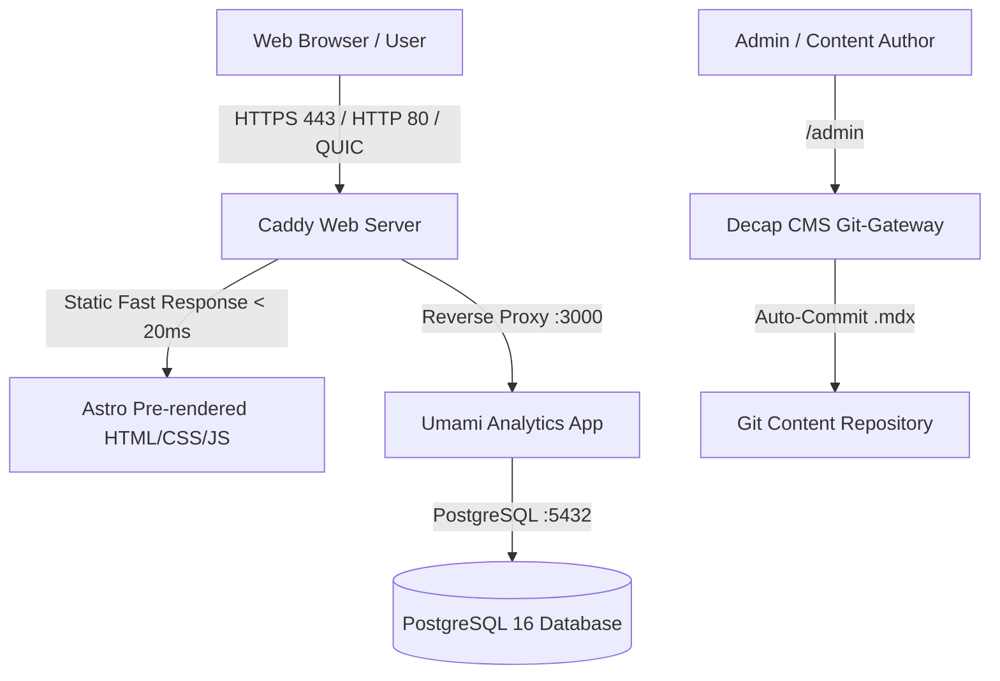

# 🚀 The Ramadhani — Authority Personal Brand & Thought Leadership Platform

> **High-Performance Static Portfolio & Thought Leadership Platform for Technical SEO, Generative Engine Optimization (GEO), and High-ROI Google Ads Consulting.**

[](https://astro.build)
[](https://react.dev)
[](https://tailwindcss.com)
[](https://www.typescriptlang.org)
[](https://caddyserver.com)
[](https://umami.is)
[](https://pagespeed.web.dev)

---

## 📖 Ringkasan Proyek

Platform ini dibangun menggunakan arsitektur modern **Jamstack & Static Site Generation (SSG)** dengan Astro 5, menghasilkan halaman web murni statis yang disajikan oleh web server Caddy dengan kompresi tingkat lanjut (Zstandard, Brotli, Gzip) dan otomatisasi sertifikat SSL HTTPS Let's Encrypt / ZeroSSL.

Platform ini dilengkapi dengan:
- ⚡ **Core Web Vitals Optimal**: LCP Sub-detik (< 0.8s), CLS 0.00, INP < 50ms.
- 🤖 **GEO & AI Search Machine-Readability**: Integrasi direct answer blocks, semantic JSON-LD Knowledge Graph, dan directive `llms.txt` untuk optimasi kutipan mesin pencari AI (Perplexity, ChatGPT Search, Claude, Google AI Overviews).
- 📊 **Self-Hosted Umami Analytics**: Pelacak analitik web tanpa cookie yang patuh GDPR/CCPA dengan perekam sesi heatmap real-time.
- ✍️ **Decap CMS**: Manajemen konten headless berbasis Git untuk publikasi artikel dan studi kasus klien secara visual.
- 🛠️ **Suite Otomasi Lengkap**: Script deployment Docker Hub, direct SCP deploy, hot-reload Caddy (50ms), dan migrasi server 1-klik.

---

## 📑 Daftar Isi

1. [Arsitektur & Tech Stack](#-arsitektur--tech-stack)
2. [Struktur Direktori Proyek](#-struktur-direktori-proyek)
3. [Panduan Menjalankan di Lingkungan Lokal](#-panduan-menjalankan-di-lingkungan-lokal)
4. [Panduan Manajemen Konten (Decap CMS)](#-panduan-manajemen-konten-decap-cms)
5. [Fitur-Fitur Interaktif (React Islands)](#-fitur-fitur-interaktif-react-islands)
6. [Panduan Deployment ke Server Produksi](#-panduan-deployment-ke-server-produksi)
7. [Panduan Umami Analytics](#-panduan-umami-analytics)
8. [Menambahkan Reverse Proxy & Hot Reload Caddy](#-menambahkan-reverse-proxy--hot-reload-caddy)
9. [Backup, Restore & Migrasi Server](#-backup-restore--migrasi-server)
10. [Referensi Environment Variables (.env)](#-referensi-environment-variables-env)
11. [Lighthouse CI & Quality Gate](#-lighthouse-ci--quality-gate)
12. [Troubleshooting & Solusi Masalah Operasional](#-troubleshooting--solusi-masalah-operasional)

---

## 🏗️ Arsitektur & Tech Stack



### Rincian Teknologi:
- **Framework Utama**: [Astro 5](https://astro.build) (Mode: `output: 'static'`)
- **Islands Architecture**: [React 19](https://react.dev) (Dengan direktif `client:visible` untuk zero main-thread blocking)
- **Styling**: [Tailwind CSS 3](https://tailwindcss.com) + `@tailwindcss/typography`
- **Web Server Produksi**: [Caddy 2](https://caddyserver.com) dengan Automatic HTTPS, HTTP/2, HTTP/3, Zstandard & Gzip
- **Analytics & Heatmaps**: [Umami Analytics](https://umami.is) dengan PostgreSQL 16 Alpine
- **Content Management**: [Decap CMS 3](https://decapcms.org) dengan Content Collections Type-Safe Schema
- **Dokumentasi Arsitektur Lengkap**: Baca [ARCHITECTURE.md](file:///wsl.localhost/Ubuntu/home/ramadhani/ramadhani2/ARCHITECTURE.md).

---

## 📁 Struktur Direktori Proyek

```text
├── .github/
│   └── workflows/
│       └── lhci.yml            # Pipeline CI/CD untuk audit Lighthouse otomatis
├── public/
│   ├── admin/
│   │   └── config.yml          # Konfigurasi skema Decap CMS
│   ├── images/                 # Aset gambar, poster WebP, dan logo
│   │   ├── uploads/            # Folder upload media CMS
│   │   └── hero-poster.webp    # High-priority hero poster image
│   ├── videos/                 # Background video stream MP4
│   ├── favicon.svg             # Favicon vektor
│   ├── llms.txt                # Directive ringkasan untuk LLM / AI Search Bot
│   └── robots.txt              # Aturan crawler Google & AI Bot
├── src/
│   ├── components/
│   │   ├── cards/              # Komponen ArticleCard & ServiceCard
│   │   ├── common/             # Header, Footer, Breadcrumbs, QuickAnswer
│   │   ├── islands/            # React Islands (PerformanceAudit, WorkFilter, dll)
│   │   └── seo/                # BaseHead (Preloads, Fonts, SEO) & JsonLd
│   ├── content/                # Content Collections MDX
│   │   ├── articles/           # File artikel & panduan (.mdx)
│   │   └── work/               # File studi kasus klien (.mdx)
│   ├── layouts/                # BaseLayout, ArticleLayout, WorkLayout, PageLayout
│   ├── pages/                  # Routing halaman website statis
│   │   ├── admin/              # Rute portal CMS (/admin)
│   │   ├── articles/           # Rute artikel (/articles, /articles/[...slug])
│   │   ├── services/           # Rute layanan (/services/seo, /geo, /google-ads)
│   │   ├── work/               # Rute studi kasus (/work, /work/[...slug])
│   │   ├── about.astro         # Halaman tentang profil & E-E-A-T
│   │   ├── contact.astro       # Halaman form konsultasi
│   │   ├── index.astro         # Halaman utama (Homepage)
│   │   └── rss.xml.ts          # Generator feed RSS 2.0 otomatis
│   ├── styles/
│   │   └── global.css          # Desain sistem tokens, animasi, & base layer
│   ├── types/                  # Schema types & interfaces TypeScript
│   └── content.config.ts       # Skema validasi Zod untuk artikel & studi kasus
├── Caddyfile                   # Konfigurasi web server Caddy produksi
├── Dockerfile                  # Multi-stage production build Dockerfile
├── docker-compose.dev.yml      # Konfigurasi Docker local development
├── docker-compose.prod.yml     # Konfigurasi container Caddy, Umami, & PostgreSQL
├── .lighthouserc.json          # Konfigurasi Lighthouse CI Quality Gate
├── deploy-dockerhub.sh         # Script deploy via Docker Hub
├── deploy.sh                   # Script deploy langsung via SSH / SCP
├── reload-caddy.sh             # Script hot-reload Caddy (50ms zero-downtime)
├── backup-server.sh            # Script backup database & konfigurasi otomatis
├── restore-server.sh           # Script restore & bootstrap server baru
├── migrate.sh                  # Script migrasi server 1-klik
├── sync-from-server.sh         # Script unduh database & media produksi ke lokal
├── ARCHITECTURE.md             # Dokumentasi arsitektur sistem mendalam
├── DEPLOY.md                   # Panduan operasional & deployment server
└── MIGRATION.md                # Panduan backup, restore & migrasi server
```

---

## 💻 Panduan Menjalankan di Lingkungan Lokal

### Prasyarat:
- **Node.js**: Versi 20 atau 22 (LTS)
- **Git**
- **Docker** *(opsional, jika ingin menguji container)*

### Langkah Instalasi:

1. **Clone & Masuk ke Direktori Proyek**:
   ```bash
   git clone <url_repo_anda>
   cd ramadhani2
   ```

2. **Install Dependencies**:
   ```bash
   npm install
   ```

3. **Salin File Konfigurasi Environment**:
   ```bash
   cp .env.example .env
   ```

4. **Jalankan Server Development**:
   ```bash
   npm run dev
   ```
   Buka browser di **`http://localhost:4321`**.

5. **Menjalankan Website + Local CMS Backend Sekaligus**:
   ```bash
   npm run dev:all
   ```
   - Website: `http://localhost:4321`
   - Decap CMS Portal: `http://localhost:4321/admin`

6. **Memeriksa Validasi Tipe & Build**:
   ```bash
   # Type check dan schema validation
   npm run check

   # Build bundle statis produksi
   npm run build

   # Preview hasil build lokal
   npm run preview
   ```

---

## ✍️ Panduan Manajemen Konten (Decap CMS)

### Mengakses CMS Portal
- **Lokal**: `http://localhost:4321/admin` *(Jalankan `npm run dev:all` terlebih dahulu)*
- **Produksi**: `https://ramadhani.cloud/admin`

### Menulis Artikel Baru:
1. Buka menu **Articles & Guides** &rarr; klik **New Article**.
2. Isi kolom yang tersedia:
   - **Title**: Judul artikel yang menarik.
   - **Description**: Ringkasan meta description (140-160 karakter).
   - **Quick Answer Block**: Ringkasan kesimpulan langsung (40-60 kata) yang akan dirender di bawah H1 untuk kutipan AI Overviews & Perplexity.
   - **Cover Image**: Pilih diagram/gambar artikel dari media library (`/images/uploads/`).
   - **Tags**: Label topik (misal: `SEO`, `GEO`, `Google Ads`).
   - **Body**: Tulis isi artikel menggunakan Markdown/MDX.
3. Klik **Publish** &rarr; Artikel otomatis tersimpan di `src/content/articles/` dan halaman statis baru akan dibangun.

### Menambahkan Studi Kasus Klien:
1. Buka menu **Case Studies & Work** &rarr; klik **New Case Study**.
2. Masukkan metrik kunci pada **Key Impact Metrics** (contoh: `+310%` / `AI Answer Citations` atau `5.2x` / `ROAS`).
3. Tulis ringkasan **Quick Answer** untuk AI citation grounding.
4. Pilih apakah studi kasus ingin ditampilkan di Homepage (`Featured: Yes/No`).
5. Klik **Publish**.

---

## ⚡ Fitur-Fitur Interaktif (React Islands)

1. **Live Core Web Vitals & GEO Search Readiness Audit (`PerformanceAudit.tsx`)**:
   - Terpasang di homepage.
   - Pengunjung dapat memasukkan URL domain mereka untuk melakukan audit live ke **Google PageSpeed Insights V5 API**.
   - Menilai kesiapan halaman terhadap mesin pencari AI (RAG latency timeout, Schema Knowledge Graph, dan AI Overviews fit).
2. **Dynamic Work Filter (`WorkFilter.tsx`)**:
   - Filter portfolio instan berdasarkan kategori layanan (*Technical SEO, GEO, Google Ads*).
3. **Article Search & Tag Filter (`ArticleFilter.tsx`)**:
   - Pencarian artikel real-time dengan filter tag kategori.
4. **FAQ Accordion dengan Schema JSON-LD Otomatis (`FaqAccordion.tsx`)**:
   - Accordion interaktif yang otomatis menyuntikkan data terstruktur `FAQPage` ke mesin pencari.
5. **Hero Interactive Canvas (`HeroInteractive.tsx`)**:
   - Visualisasi interaktif performa tinggi pada hero section.

---

## 🚀 Panduan Deployment ke Server Produksi

### Metode 1: Deploy Melalui Direct SCP (Direkomendasikan)
Membangun image di mesin lokal, mengompresi ke tar.gz, dan mengirimkannya ke VPS tanpa perlu login registry publik:
```bash
./deploy.sh [vps-user] [vps-ip] [path-to-ssh-key] [ssh-port]

# Contoh:
./deploy.sh root 103.175.217.71 ~/.ssh/id_rsa
```

### Metode 2: Deploy Melalui Docker Hub
```bash
./deploy-dockerhub.sh <username_dockerhub> [vps-user] [vps-ip] [path-to-ssh-key] [ssh-port]

# Contoh:
./deploy-dockerhub.sh ramanur root 103.175.217.71
```

### Metode 3: Menjalankan Secara Native Tanpa Docker
Untuk menjalankan website langsung di VPS Linux tanpa container:
1. Build file statis di lokal:
   ```bash
   npm run build
   ```
2. Salin folder `./dist` ke VPS via rsync:
   ```bash
   rsync -avz --delete ./dist/ root@103.175.217.71:/var/www/ramadhani/
   ```
3. Pasang Caddy 2 di Ubuntu/Debian dan konfigurasikan `/etc/caddy/Caddyfile`:
   ```caddy
   ramadhani.cloud {
       root * /var/www/ramadhani
       encode zstd gzip
       file_server
       try_files {path} {path}/ /index.html
   }
   ```
4. Reload Caddy:
   ```bash
   sudo systemctl reload caddy
   ```

*Panduan deployment terperinci tersedia di [DEPLOY.md](file:///wsl.localhost/Ubuntu/home/ramadhani/ramadhani2/DEPLOY.md).*

---

## 📊 Panduan Umami Analytics

1. **URL Akses Dashboard**:
   - **Produksi**: `https://analytics.ramadhani.cloud`
   - **Direct Port VPS**: `http://103.175.217.71:3000`
2. **Kredensial Default**:
   - Username: `admin`
   - Password: `umami` *(Wajib segera diubah setelah login pertama di menu Settings &rarr; Profile)*
3. **Fitur yang Aktif**:
   - Perekaman pageviews real-time tanpa cookie (GDPR/CCPA compliant).
   - Perekaman sesi visual & heatmap (*recorder.js*).
   - Kompatibilitas navigasi instan Astro View Transitions.

---

## 🔀 Menambahkan Reverse Proxy & Hot Reload Caddy

Jika Anda ingin menjalankan aplikasi lain di VPS yang sama (misal API backend di port `8080` atau subdomain baru `app.ramadhani.cloud`):

1. **Edit `Caddyfile`**:
   ```caddy
   app.{$SITE_DOMAIN:ramadhani.cloud} {
       reverse_proxy host.docker.internal:8080
   }
   ```
2. **Reload Caddy Tanpa Restart Container (Zero-Downtime)**:
   ```bash
   ./reload-caddy.sh
   ```
   *(Atau jalankan: `docker exec ramadhani-web-prod caddy reload --config /etc/caddy/Caddyfile`)*.
3. Caddy akan otomatis menerbitkan sertifikat SSL HTTPS untuk subdomain baru dalam waktu **50 milidetik**.

---

## 📦 Backup, Restore & Migrasi Server

Seluruh tools otomasi migrasi telah tersedia di root repository:

| Aksi | Perintah |
| :--- | :--- |
| **Migrasi 1-Klik ke Server Baru** | `./migrate.sh <IP_LAMA> <IP_BARU> root ~/.ssh/id_rsa` |
| **Backup Sistem di VPS** | `./backup-server.sh` |
| **Restore di VPS Baru** | `./restore-server.sh <file_backup.tar.gz>` |
| **Tarik Database & Media ke Komputer Lokal** | `./sync-from-server.sh <IP_VPS> root ~/.ssh/id_rsa` |

Petunjuk konfigurasi jadwal backup otomatis (cron job) dan disaster recovery tersedia di [MIGRATION.md](file:///wsl.localhost/Ubuntu/home/ramadhani/ramadhani2/MIGRATION.md).

---

## ⚙️ Referensi Environment Variables (.env)

Berikut adalah daftar lengkap seluruh variabel konfigurasi yang didukung:

| Variabel | Deskripsi | Default / Contoh |
| :--- | :--- | :--- |
| `WEB_IMAGE` | Nama image container web produksi | `ramadhani-web:latest` |
| `SITE_DOMAIN` | Domain utama untuk penerbitan SSL Caddy | `ramadhani.cloud` |
| `SITE_URL` | URL kanonikal untuk SEO, OG, dan Sitemap | `https://ramadhani.cloud` |
| `ACME_EMAIL` | Email pendaftaran sertifikat Let's Encrypt | `ramanur321@gmail.com` |
| `UMAMI_DB_NAME` | Nama database PostgreSQL Umami | `umami_analytics` |
| `UMAMI_DB_USER` | Username user database Umami | `umami_admin` |
| `UMAMI_DB_PASSWORD` | Password database PostgreSQL Umami | `[password_aman_anda]` |
| `UMAMI_APP_SECRET` | Salt string 32+ karakter acak untuk Umami | `[random_32_chars_secret]` |
| `PUBLIC_UMAMI_WEBSITE_ID`| ID website Umami untuk script tracking | `1caa2dcc-1a6e-4727-be26-0f3e6dc7c05b` |
| `PUBLIC_UMAMI_HOST_URL`  | URL host tracking Umami di frontend | `https://analytics.ramadhani.cloud` |
| `CONTACT_FORM_ENDPOINT`  | Endpoint pengiriman formulir kontak | `https://api.ramadhani.cloud/contact` |
| `CONTACT_EMAIL_NOTIFICATION` | Email tujuan notifikasi kontak | `contact@ramadhani.cloud` |

---

## 🛡️ Lighthouse CI & Quality Gate

Pipeline GitHub Actions [`.github/workflows/lhci.yml`](file:///wsl.localhost/Ubuntu/home/ramadhani/ramadhani2/.github/workflows/lhci.yml) secara otomatis memvalidasi kualitas kode pada setiap *Pull Request* dan *Push*:

- **Performance**: Skor Minimal &ge; 85%
- **Accessibility**: Skor Minimal &ge; 90%
- **Best Practices**: Skor Minimal &ge; 90%
- **SEO**: Skor Minimal &ge; 95%
- File Konfigurasi: [`.lighthouserc.json`](file:///wsl.localhost/Ubuntu/home/ramadhani/ramadhani2/.lighthouserc.json)

---

## 🔧 Troubleshooting & Solusi Masalah Operasional

### 1. Port 80 atau 443 Sudah Digunakan (Port Conflict)
Jika container web gagal menyala dengan error `bind: address already in use`:
```bash
# Periksa proses yang menggunakan port:
sudo lsof -i :80 -i :443
# Matikan Apache/Nginx bawaan jika berjalan di VPS:
sudo systemctl stop nginx apache2
sudo systemctl disable nginx apache2
```

### 2. Sertifikat SSL Gagal Terbit
Pastikan:
- DNS Record `@` dan `www` sudah mengarah ke IP publik VPS: `dig +short ramadhani.cloud @8.8.8.8`.
- Firewall VPS mengizinkan traffic HTTP (80) untuk ACME HTTP-01 challenge: `sudo ufw allow 80/tcp`.

### 3. Decap CMS Gagal Login / "API error: Not Found"
- **Di Lingkungan Lokal**: Pastikan backend lokal berjalan dengan `npm run dev:all` (port 8081).
- **Di Produksi**: Pastikan OAuth App GitHub telah terkonfigurasi dengan Callback URL yang sesuai (`https://ramadhani.cloud/callback`).

### 4. Umami Database Connection Timeout
Periksa status container database PostgreSQL:
```bash
docker compose -f docker-compose.prod.yml ps umami-db
docker logs -f ramadhani-umami-db --tail 30
```

---

## 📄 Lisensi & Hak Cipta

&copy; 2026 **The Ramadhani**. Engineered for performance, authority, and answer search.